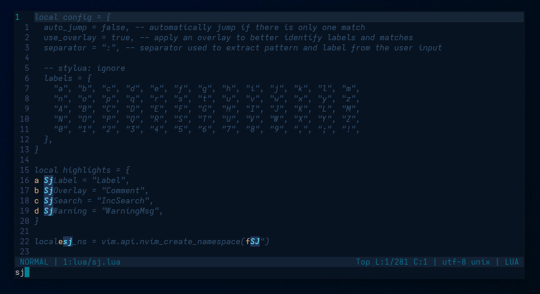

- [Requirements](#requirements)
- [Usage](#usage)
- [Configuration](#configuration)
- [Why this plugin ?](#why-this-plugin)
- [Known issues](#know-issues)

# SJ - Search and Jump

Search based navigation combined with quick jump features.



## Requirements

To use this plugin, you need :

- to have [Neovim](https://github.com/neovim/neovim)
  ['nightly'](https://github.com/neovim/neovim/releases/tag/nightly) version installed ;
- to add `woosaaahh/sj.nvim` in your plugin manager configuration.

Here are some examples :

- [vim-plug](https://github.com/junegunn/vim-plug) `Plug 'woosaaahh/sj.nvim'` ;
- [packer.nvim](https://github.com/wbthomason/packer.nvim) `use 'woosaaahh/sj.nvim'` ;
- [paq-nvim](https://github.com/savq/paq-nvim) `"woosaaahh/sj.nvim"`.

## Usage

The goal of this plugin is to quickly navigate to any characters/words that are visible in
the current buffer and quickly jump to any match.

To do so, use a keymap ([Configuration](#configuration)) and type a pattern.

As soon as you use the keymap and start typing the pattern :

- the highights in the buffer will change ;
- all matches will be highlighted and will have a label assigned to them ;
- the current pattern is displayed in the command line.

Now you can :

- jump to the first match by pressing the `<Enter>` key or `<C-j>` ;
- jump to any matches by typing `:`, then the label assigned to the match ;
- delete previous characters by pressing `<Backspace>` or `<Control-h>` ;
- delete the pattern by pressing `<Control-u>` ;
- cancel everything by pressing the `<Escape>` key.

Notes :

- There is an `auto_jump` feature which will automatically jump to a match if it is the
  only one in the visible area. You will not have to type `<Enter>` or `:` and a label ;
- If there are no matches for the current pattern, the pattern in the command line will be
  displayed in a different color. Starting from `0.2.0`, you can restore the last matching
  pattern by pressing `<Alt-Backspace>`.

## Configuration

Here is the default configuration :

```lua
local config = {
	auto_jump = false, -- automatically jump if there is only one match
	use_overlay = true, -- apply an overlay to better identify labels and matches
	separator = ":", -- separator used to extract pattern and label from the user input
	label_as_prefix = false, -- if true, the label will be positioned before the match

	-- stylua: ignore
	labels = {
		"a", "b", "c", "d", "e", "f", "g", "h", "i", "j", "k", "l", "m",
		"n", "o", "p", "q", "r", "s", "t", "u", "v", "w", "x", "y", "z",
		"A", "B", "C", "D", "E", "F", "G", "H", "I", "J", "K", "L", "M",
		"N", "O", "P", "Q", "R", "S", "T", "U", "V", "W", "X", "Y", "Z",
		"0", "1", "2", "3", "4", "5", "6", "7", "8", "9", ",", ";", "!",
	},
}
```

and here is a configuration sample :

```lua
local sj = require("sj")
sj.setup({
	-- automatically jump on a match if it is the only one
	auto_jump = true,
	-- help to better identify labels and matches
	use_overlay = true,
	highlights = {
		-- used for the labels
		SjLabel = { bold = false },
		-- used for everything that is not a match
		SjOverlay = { bold = false, italic = false },
		-- used to highlight matches
		SjSearch = { bold = false },
		-- used in the cmd line when the pattern has no matches
		SjWarning = { bold = false },
	},
})
vim.keymap.set("n", "s", sj.run)
```

## Why this plugin ?

Using vertical/horizontal navigation with `<count>k/j`, `:<count><CR>`, `H/M/L/f/F/t/T/,/;b/e/w^/$`,
is a very good way to navigate. But with the keyboards I use, I have to press the
`<Shift>` key to type numbers and some of them are a bit to far for my fingers.
Once on the good line, I have to repeat pressing some vertical movement keys too much.

When navigating in a buffer, I often find the search based navigation to be easier, faster
and more precise. But if there are too many matches, I have to repeat pressing a key to
cycle between the matches. By adding jump features with labels, I can quickly jump to the
match I want.

For me, one small caveat of the 'jump plugins', is that they generate the labels or 'hint
keys' based on the cursor position. That is understandable and efficient but within the
same buffer area, it means that you can have different labels for the same pattern/position
which make the keys sequence for a jump less predictables. Also, in some
contexts, you don't know if you'll have to use a 1, 2 or 3 characters for the label.

By using a search pattern with a 1 character label, you can narrow the list of labels and
you already know all the keys except one character for the label.

## Known issues

This plugin is fairly new and some things might change in the next days or weeks.

Right now :

- ~~I don't know how to catch the `<Backspace>` key, hence the `<Control-h>`~~ modified by [e18ae614](https://github.com/woosaaahh/sj.nvim/commit/e18ae6141113a12c58c7d396dc995966bb1af28f) ;
- ~~If a match is at the beginning of an indentend line, there is an offset of the
  label~~ modified by [90b7b99b](https://github.com/woosaaahh/sj.nvim/commit/90b7b99becb5e9fcd1e9cdd03ee4b4f8ce4851db).
